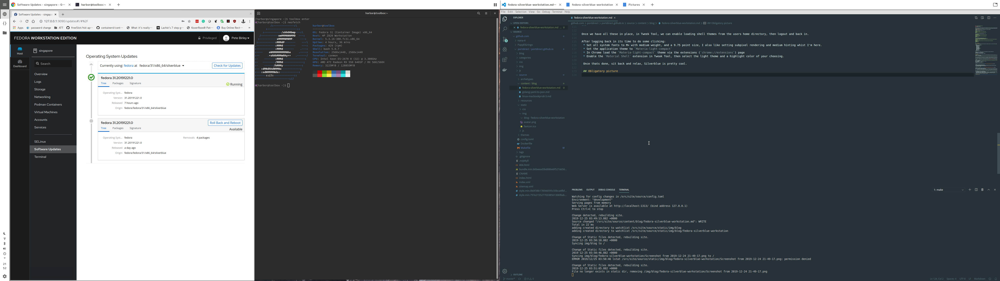

Fedora Silverblue is pretty nice, but out of the box lacks some of the tools I tend to use. Though in many cases flatpak, or the Fedora Toolbox container, lets you deploy applications without effecting the underlying distrobution, a few things fall outside of their scope/capabilities. The following is how I install Chrome, VSCode, Cockpit, and also customise Gnome to my liking:

### Add additional repos
Adding new rpm repos to rpm-ostree is pretty simple for layering new packages:
```shell
sudo tee /etc/yum.repos.d/vscode.repo << 'EOF'
[code]
name=Visual Studio Code
baseurl=https://packages.microsoft.com/yumrepos/vscode
enabled=1
gpgcheck=1
gpgkey=https://packages.microsoft.com/keys/microsoft.asc
EOF

sudo tee /etc/yum.repos.d/google-chrome.repo << 'EOF'
[google-chrome]
name=google-chrome
baseurl=http://dl.google.com/linux/chrome/rpm/stable/x86_64
skip_if_unavailable=True
gpgcheck=1
gpgkey=https://dl.google.com/linux/linux_signing_key.pub
enabled=1
enabled_metadata=1
EOF

sudo tee /etc/yum.repos.d/cockpit-preview.repo << 'EOF'
[copr:copr.fedorainfracloud.org:group_cockpit:cockpit-preview]
name=Copr repo for cockpit-preview owned by @cockpit
baseurl=https://copr-be.cloud.fedoraproject.org/results/@cockpit/cockpit-preview/fedora-$releasever-$basearch/
type=rpm-md
skip_if_unavailable=True
gpgcheck=1
gpgkey=https://copr-be.cloud.fedoraproject.org/results/@cockpit/cockpit-preview/pubkey.gpg
repo_gpgcheck=0
enabled=1
enabled_metadata=1
EOF
```

### Install packages
Next we install the packages we need, and finish off with a reboot to allow us to to start with the new commit.

```shell
rpm-ostree install --idempotent \
    gnome-tweak-tool \
    gtk-murrine-engine \
    cockpit-ws \
    cockpit-dashboard \
    cockpit-system \
    cockpit-ostree \
    cockpit-storaged \
    cockpit-networkmanager \
    cockpit-selinux \
    cockpit-machines \
    cockpit-podman \
    code \
    google-chrome-stable \
    make
systemctl reboot
```

Once we are back we can enable, and start, the cockpit webserver, and open the required ports:
```shell
sudo systemctl enable --now cockpit.socket
sudo firewall-cmd --add-service=cockpit
sudo firewall-cmd --add-service=cockpit --permanent
```

### Theme Gnome
Ok, with the practicalities out of the way, lets get a pretty desktop picture that spans the two monitors I'm using:
```shell
mkdir -p ~/Pictures/Wallpapers
curl -sSL -o ~/Pictures/Wallpapers/yosemite.jpg https://binaryfortressdownloads.com/Download/WPF/Images/21505/WallpaperFusion-yosemite-5120x1440.jpg
```

Then with Gnome Tweak Tool, we can set this to be the the wallpaper for both the desktop, and lock screen. You need to use Tweak Tool (or the cli command I keep forgetting) to do this, so you can set the image to span the monitors, rather than be scaled on each of them. While we are in Tweak Tool, we might was well clean up a few other things, first lets ditch the background logo extension, and kill virtually all the other fluff thats enabled by default.


Once things are stipped back a bit, we can move onto more drastic changes to get us a tiled windoesing config, that combines some of the best of Gnome (pretty) with the efficiency (application screen real estate) of i3/sway. The first stage of this is to collect the bits we need, starting with the [M+](https://mplus-fonts.osdn.jp/) font collection:

```shell
curl -sSL -o /tmp/mplus.tar.xz "https://osdn.net/frs/redir.php?m=pumath&f=mplus-fonts%2F62344%2Fmplus-TESTFLIGHT-063a.tar.xz"
mkdir -p /tmp/mplus-fonts
tar -xJf /tmp/mplus.tar.xz -C /tmp/mplus-fonts --strip=1
mkdir -p ~/.fonts
cp /tmp/mplus-fonts/*.ttf ~/.fonts/
rm -rf /tmp/mplus-fonts /tmp/mplus.tar.xz
fc-cache
```

Once thats done, lets get and install the [materia](https://github.com/nana-4/materia-theme) theme:

```shell
mkdir -p ~/Development/Source/github.com/nana-4/
git clone https://github.com/nana-4/materia-theme.git ~/Development/Source/github.com/nana-4/materia-theme
cd ~/Development/Source/github.com/nana-4/materia-theme
./install.sh --dest ~/.themes
```

Finally we get the wonderful [material-shell](https://github.com/PapyElGringo/material-shell) extension:

```shell
mkdir -p ~/Development/Source/github.com/PapyElGringo
git clone https://github.com/PapyElGringo/material-shell.git ~/Development/Source/github.com/PapyElGringo/material-shell
ln -s ~/Development/Source/github.com/PapyElGringo/material-shell ~/.local/share/gnome-shell/extensions/material-shell@papyelgringo
```

Once we have all these in place, in Tweek Tool, we can enable loading shell themes from the users home directory, then logout and back in.

After logging back in its time to do some clicking:
 * Set all system fonts to M+ with medium weight, and a 9.75 point size, I also like setting subpixel rendering and medium hinting whist I'm here.
 * Set the application theme to `Materia-light-compact`
 * In Chrome load the `Materia-light-compact` theme via the extensions (`chrome://extensions`) page
 * Enable the `Material Shell` extension in Tweak Tool, then select the light theme and a highlight color of your choosing.

 Once thats done, sit back and relax, Silverblue is pretty cool.

 ## Obligatory picture
 